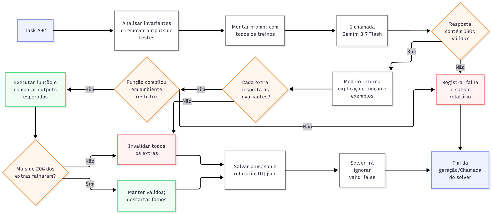

## Objetivo da semana

Treinar o modelo e verificar sua acuracia, usando como referencia as versoes anteriores apresentadas no artigo **Mini-ARC**.

- Reproduzir uma configuracao de baseline para o nosso modelo
- Medir o desempenho em um conjunto de 114 tarefas ARC-AGI
- Estabelecer uma referencia para comparar as estrategias de inferencia

## Configuracao do treinamento

::: {.training-config}

| Recurso | Configuracao |
|---|---|
| Arquitetura | Transformer |
| Duracao | 3h30 |
| Epocas | 100 |
| Hardware | 8 NVIDIA A100 |

:::

## Resultados atuais

O nosso baseline e mais comparavel a versao reduzida do Mini-ARC, que alcancou **17,5%**.

Resultados obtidos com a configuracao minima do nosso baseline:

::: {.incremental}
- **Com TTT:** 4,5% (**5 de 114 tarefas**)
- **Sem TTT:** 0% (**0 de 114 tarefas**)

Como referencia adicional, a versao completa do Mini-ARC reportou **41,2%** com TTT e refinamento em um subconjunto de 114 tarefas.
:::

## Comparacao com o Mini-ARC

- A versao reduzida do Mini-ARC, mais comparavel ao nosso baseline, alcancou **17,5%**.
- A versao completa do Mini-ARC combina Transformer, TTT e refinamento, alcancando **41,2%**.
- Nossa configuracao minima alcancou **4,5% com TTT**.
- A comparacao mostra a distancia atual para a referencia e orienta os proximos experimentos.
- O objetivo desta etapa e medir o efeito de cada fonte adicional de informacao de forma controlada.

## Pipeline de geracao de exemplos

A imagem mostra o processo usado para gerar exemplos adicionais corretos antes da inferencia.

{width=100%}

## Como o pipeline funciona

1. A task ARC e recebida e seus invariantes sao analisados.
2. Os outputs das tarefas de teste sao removidos antes da geracao.
3. Um prompt com todos os exemplos de treinamento e enviado ao **Gemini 3.7 Flash**.
4. A resposta e validada como JSON e os exemplos sao testados quanto aos invariantes.
5. Exemplos que nao compilam no ambiente restrito ou nao reproduzem a regra sao descartados.

## Controle de qualidade

- Se mais de **20%** dos exemplos gerados falharem, todos os novos exemplos daquela task sao invalidados.
- As tasks invalidas sao registradas em um relatorio para facilitar a analise.
- Durante a inferencia, os solvers ignoram exemplos marcados como `valid=false`.
- Apenas exemplos aprovados seguem para o solver e para a comparacao dos outputs esperados.

## Conclusoes parciais

- O baseline atual resolve 5 de 114 tarefas quando usa TTT.
- A validacao e necessaria antes de fornecer exemplos gerados ao solver.
- A comparacao com o Mini-ARC fornece uma referencia para avaliar a evolucao do projeto.
- Ainda precisamos medir separadamente o impacto da data augmentation e dos exemplos adicionais.

## Proximos passos

1. Testar novamente apenas o **baseline**, que corresponde aos resultados atuais.
2. Testar o **baseline com data augmentation**.
3. Testar o **baseline com mais exemplos corretos**, gerados e validados pela pipeline.
